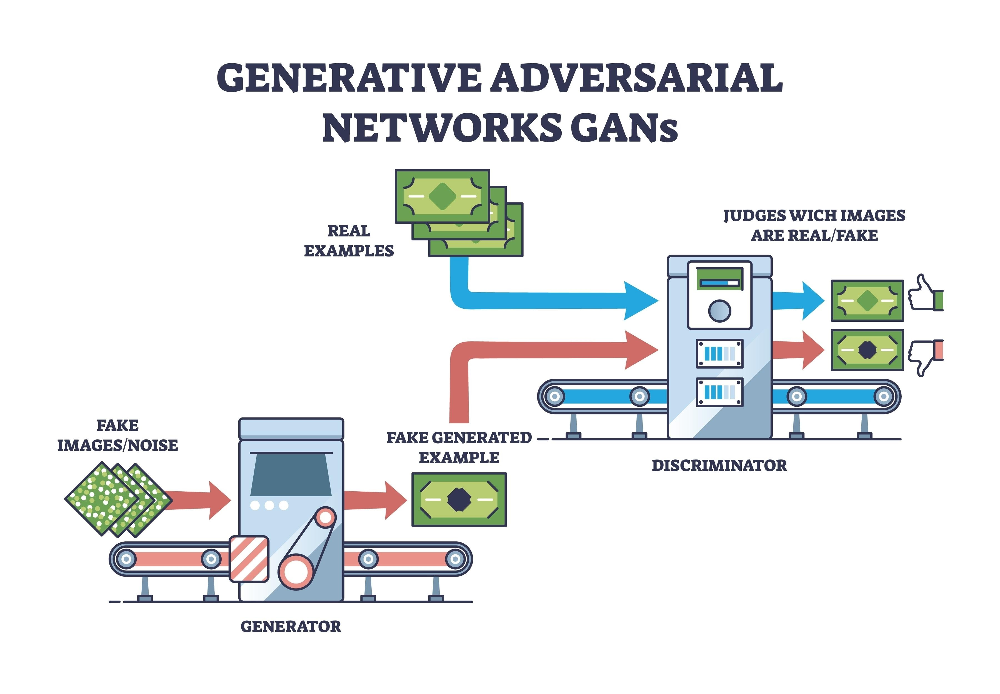

# Pix2Pix Üretici Çekişmeli Ağlar ile Topoloji Optimizasyonu

**Koşullu çekişmeli ağlar kullanılarak otomatik yapısal tasarım optimizasyonu için uçtan uca derin öğrenme çerçevesi.**

---

## İçindekiler

- [Genel Bakış](#genel-bakış)
- [Temel Özellikler](#temel-özellikler)
- [Mimari](#mimari)
- [Kurulum](#kurulum)
- [Proje Yapısı](#proje-yapısı)
- [Kullanım](#kullanım)
  - [Eğitim](#eğitim)
  - [Çıkarım](#çıkarım)
  - [3D Görselleştirme](#3d-görselleştirme)
- [Teknik Özellikler](#teknik-özellikler)
- [Performans Hususları](#performans-hususları)
- [Katkıda Bulunma](#katkıda-bulunma)
- [Alıntılama](#alıntılama)
- [Lisans](#lisans)
- [İletişim](#iletişim)

---

## Genel Bakış

Bu depo, otomatik topoloji optimizasyonu için Pix2Pix mimarisine dayalı koşullu Üretici Çekişmeli Ağ (cGAN) uygulamasını içermektedir. Sınır koşulları ve yükleme senaryoları verildiğinde, model yapısal bütünlüğü korurken malzeme kullanımını minimize eden optimize edilmiş yapısal tasarımlar üretir.

### Problem Tanımı

Geleneksel topoloji optimizasyon yöntemleri, hesaplama açısından pahalı ve zaman alıcı olan yinelemeli sonlu elemanlar analizine (FEA) dayanır. Bu proje, derin öğrenme kullanarak giriş koşullarından optimize tasarımları doğrudan tahmin etmeyi öğrenen veri odaklı bir alternatif sunar.

**Geleneksel Yöntemlerin Zorlukları:**
- Yüksek hesaplama maliyeti (saatler - günler)
- Uzman bilgisi gereksinimi
- Her yeni senaryo için yeniden hesaplama
- Karmaşık geometriler için sınırlamalar

**Derin Öğrenme Yaklaşımının Avantajları:**
- Gerçek zamanlı tahminler (<10ms)
- Otomatik özellik öğrenme
- Eğitim sonrası hızlı çıkarım
- Karmaşık desenleri yakalama yeteneği

### Çözüm Yaklaşımı

Sistem, uzamsal bilgiyi korumak için atlama bağlantılarına sahip U-Net üretici ve yerel doku ayrımcılığı için PatchGAN ayırıcı kullanır. Model, yükleme koşulları ve bunlara karşılık gelen optimize yapılar içeren eşleştirilmiş örnekler üzerinde eğitilir.

---

## Temel Özellikler

### Temel Yetenekler

- **Uçtan Uca Öğrenme**: Sınır koşullarından optimize yapılara doğrudan eşleme
- **Gerçek Zamanlı Çıkarım**: Eğitim sonrası milisaniyeler içinde tasarım üretimi
- **Çok Ölçekli Özellik Çıkarımı**: U-Net mimarisi hem yerel hem de küresel desenleri yakalar
- **Çekişmeli Eğitim**: PatchGAN ayırıcı gerçekçi, üretilebilir tasarımlar sağlar
- **3D Dışa Aktarım Boru Hattı**: STL mesh üretimi için Marching Cubes algoritması
- **Esnek Giriş Formatı**: Dosya adlandırma kurallarının otomatik tespiti

### Teknik Vurgular

- CUDA hızlandırmalı PyTorch 2.0+ uygulaması
- Otomatik karma hassasiyet eğitim desteği
- Çıkarım için toplu işleme yetenekleri
- Morfolojik işlemlerle son işleme
- Yapılandırılabilir çözünürlüklü voxel tabanlı 3D yeniden yapılandırma

---

## Mimari

### GAN Mimarisi



*Generative Adversarial Network (GAN) yapısı: Generator sahte örnekler üretir, Discriminator gerçek ve sahte örnekleri ayırt eder. Bu çekişmeli eğitim süreci, modelin yüksek kaliteli yapısal tasarımlar üretmesini sağlar.*

### Ağ Tasarımı

#### Üretici: Atlama Bağlantılı U-Net

Üretici, simetrik atlama bağlantılarına sahip kodlayıcı-kod çözücü mimarisini takip eder:
```
Girdi (256×256×3) → Kodlayıcı → Darboğaz → Kod Çözücü → Çıktı (256×256×3)
                        ↓                          ↑
                  Atlama Bağlantıları (8 seviye)
```

**Kodlayıcı Özellikleri:**
- Aşamalı örnekleme azaltmalı 8 evrişim bloğu
- Özellik haritaları: 64 → 128 → 256 → 512 (×5)
- İlk ve son hariç tüm katmanlarda batch normalizasyonu
- Leaky ReLU aktivasyonu (α=0.2)
- Düzenlileştirme için derin katmanlarda dropout (p=0.5)

**Kod Çözücü Özellikleri:**
- Örnekleme artırmalı 7 ters evrişim bloğu
- Özellik haritaları: 512 (×4) → 256 → 128 → 64
- İlgili kodlayıcı özellikleriyle birleştirme
- Batch normalizasyonu ve ReLU aktivasyonu
- İlk üç kod çözücü bloğunda dropout (p=0.5)
- Son katman: [-1, 1] çıktı aralığı için Tanh aktivasyonu

#### Ayırıcı: PatchGAN

Ayırıcı, 70×70 örtüşen yamaları gerçek veya üretilmiş olarak sınıflandırır:
```
Girdi (256×256×6) → Evrişim Blokları (×4) → Çıktı (30×30×1)
```

**Mimari Detayları:**
- Giriş kanalları: 6 (birleştirilmiş koşul ve hedef görüntüler)
- Stride-2 örnekleme azaltmalı evrişim blokları
- Özellik ilerlemesi: 64 → 128 → 256 → 512
- İlk katman hariç batch normalizasyonu
- Leaky ReLU aktivasyonu (α=0.2)
- Çıktı: Yerel yamalar için gerçek/sahte olasılık haritası

### Kayıp Fonksiyonları

Eğitim amacı, çekişmeli ve yeniden yapılandırma kayıplarını birleştirir:

**Üretici Kaybı:**
```
L_G = L_GAN(G) + λ × L_L1(G)
```

Burada:
- `L_GAN(G) = E[log(D(x, G(x)))]` - Çekişmeli kayıp
- `L_L1(G) = E[||y - G(x)||_1]` - L1 piksel bazlı yeniden yapılandırma kaybı
- `λ = 100` - Çekişmeli ve yeniden yapılandırma hedeflerini dengeleyen ağırlık faktörü

**Ayırıcı Kaybı:**
```
L_D = E[log(D(x, y))] + E[log(1 - D(x, G(x)))]
```

L1 kaybı düşük frekanslı doğruluğu teşvik ederken, çekişmeli kayıp yüksek frekanslı detayları yakalar.

---

## Kurulum

### Ön Gereksinimler

- Python 3.8 veya üzeri
- CUDA destekli GPU (eğitim için önerilir)
- Minimum 8GB RAM (GPU eğitimi için 12GB+ önerilir)
- 2GB+ kullanılabilir disk alanı

### Ortam Kurulumu
```bash
# Depoyu klonlayın
git clone https://github.com/siracgezgin/topology-optimization-pix2pix.git
cd topology-optimization-pix2pix

# Sanal ortam oluşturun
python -m venv venv

# Sanal ortamı etkinleştirin
# Windows:
venv\Scripts\activate
# Linux/macOS:
source venv/bin/activate

# Bağımlılıkları yükleyin
pip install -r requirements.txt

# Kurulumu doğrulayın
python -c "import torch; print(f'PyTorch: {torch.__version__}, CUDA: {torch.cuda.is_available()}')"
```

### Bağımlılıklar

| Paket | Versiyon | Amaç |
|---------|---------|---------|
| PyTorch | ≥2.0.0 | Derin öğrenme çerçevesi |
| torchvision | ≥0.15.0 | Görüntü dönüşümleri |
| NumPy | ≥1.24.0 | Sayısal hesaplamalar |
| Pillow | ≥9.5.0 | Görüntü G/Ç işlemleri |
| Matplotlib | ≥3.7.0 | Görselleştirme |
| scikit-image | ≥0.21.0 | Marching Cubes algoritması |
| SciPy | ≥1.10.0 | Bilimsel hesaplama |
| trimesh | ≥3.23.0 | 3D mesh işlemleri |

---

## Proje Yapısı
```
topology-optimization-pix2pix/
│
├── models/
│   ├── __init__.py
│   ├── generator.py              # U-Net üretici uygulaması
│   └── discriminator.py          # PatchGAN ayırıcı
│
├── utils/
│   ├── __init__.py
│   └── dataset.py                # Otomatik padding tespitli özel dataset yükleyici
│
├── scripts/
│   ├── train.py                  # Eğitim boru hattı (GAN)
│   ├── inference_2d.py           # 2D çıkarım ve görselleştirme
│   └── inference_3d.py           # 3D yeniden yapılandırma ve STL dışa aktarım
│
├── examples/
│   └── quick_start.py            # Minimum çalışan örnek
│
├── assets/
│   └── (şekiller ve diyagramlar)
│
├── requirements.txt              # Python bağımlılıkları
├── README.md                     # Dokümantasyon
├── LICENSE                       # MIT Lisansı
└── .gitignore                    # Git ignore kuralları
```

---

## Kullanım

### Eğitim

#### Dataset Hazırlama

Veri setinizi şu yapıyla düzenleyin:
```
dataset/
├── input_000.png    # Sınır koşulları ve yükler
├── target_000.png   # Optimize yapı
├── input_001.png
├── target_001.png
...
└── input_N.png
    target_N.png
```

**Dataset Özellikleri:**
- Toplam örnek sayısı: 454 eşleştirilmiş görüntü (input_000 - input_453)
- Görüntü boyutu: 256×256 piksel (otomatik yeniden boyutlandırma)
- Format: PNG (kayıpsız sıkıştırma)
- Renk uzayı: RGB (3 kanal)
- Dosya adlandırma: Otomatik padding tespiti (input_0.png veya input_000.png)

**Dataset Özellikleri:**
- Toplam örnek sayısı: 454 eşleştirilmiş görüntü (input_000 - input_453)
- Görüntü boyutu: 256×256 piksel (otomatik yeniden boyutlandırma)
- Format: PNG (kayıpsız sıkıştırma)
- Renk uzayı: RGB (3 kanal)

**Giriş Görüntüsü Kuralı:**
- Mavi pikseller (B=255): Sabit sınır koşulları (duvar/destek)
- Kırmızı pikseller (R=255): Uygulanan yükler/kuvvetler
- Beyaz pikseller (RGB=255): Tasarım alanı (uygun alan)

**Hedef Görüntü Kuralı:**
- Siyah pikseller (RGB=0): Katı malzeme (yapı)
- Beyaz pikseller (RGB=255): Boşluk (boş alan)

#### Eğitim Yürütme

**Yerel Eğitim:**
```bash
python scripts/train.py --data_path /yol/dataset --epochs 50 --batch_size 16
```

**Google Colab Eğitimi:**
```python
# dataset.zip dosyasını /content/ dizinine yükleyin
# Eğitim scriptini çalıştırın
!python scripts/train.py
```

#### Hiperparametreler

| Parametre | Varsayılan | Açıklama |
|-----------|---------|-------------|
| `--epochs` | 50 | Eğitim epoch sayısı |
| `--batch_size` | 16 | Batch boyutu (GPU belleğine göre ayarlayın) |
| `--lr` | 0.0002 | Adam optimizer için öğrenme oranı |
| `--lambda_l1` | 100 | L1 yeniden yapılandırma kaybı ağırlığı |
| `--img_size` | 256 | Giriş/çıkış görüntü çözünürlüğü |
| `--save_interval` | 10 | Checkpoint kaydetme sıklığı |

#### Eğitim Süreci

1. **Veri Yükleme**: ZIP çıkarımı ve otomatik padding tespiti
2. **Başlatma**: Rastgele ağırlık başlatma veya checkpoint yükleme
3. **Eğitim Döngüsü**:
   - Üretici üzerinden ileri geçiş
   - Ayırıcı güncelleme (gerçek vs. sahte sınıflandırma)
   - Üretici güncelleme (çekişmeli + L1 kayıpları)
   - Her N epoch'ta doğrulama ve görselleştirme
4. **Model Kaydetme**: Doğrulama kaybına göre en iyi model checkpoint'i

**Beklenen Eğitim Süresi:**
- GPU (RTX 3090): 50 epoch için ~2-3 saat
- GPU (GTX 1080): 50 epoch için ~4-6 saat
- CPU: Önerilmez (>48 saat)

**Eğitim İzleme:**
Eğitim sırasında her 10 epoch'ta:
- Generator ve Discriminator kayıpları konsola yazdırılır
- Örnek tahminler görselleştirilir (matplotlib)
- Model checkpoint'leri kaydedilir (`generator_epoch_N.pth`)
- Kaybın azalma eğilimi takip edilir

**Eğitim İzleme:**
Eğitim sırasında her 10 epoch'ta:
- Generator ve Discriminator kayıpları konsola yazdırılır
- Örnek tahminler görselleştirilir
- Model checkpoint'leri kaydedilir (`generator_epoch_N.pth`)

---

### Çıkarım

#### 2D Tahmin ve Görselleştirme
```python
from models.generator import GeneratorUNet
import torch

# Eğitilmiş modeli yükle
model = GeneratorUNet()
model.load_state_dict(torch.load('pix2pix_generator.pth'))
model.eval()
model.to('cuda')

# Giriş tensörü hazırla ([-1, 1] aralığına normalize edilmiş)
input_tensor = prepare_input()  # Ön işleme fonksiyonunuz

# Tahmin üret
with torch.no_grad():
    output = model(input_tensor)

# Son işleme
output_image = (output[0].cpu().permute(1, 2, 0).numpy() + 1.0) / 2.0
```

#### Toplu Çıkarım
```python
# Birden fazla tasarımı işle
results = []
for input_batch in dataloader:
    with torch.no_grad():
        outputs = model(input_batch.to('cuda'))
    results.append(outputs.cpu())
```

#### Eşik Tabanlı İkili Sınıflandırma
```python
import numpy as np

# Gri tonlamaya dönüştür
grayscale = np.mean(output_image, axis=2)

# Eşik uygula (istenen malzeme yoğunluğuna göre ayarlanabilir)
threshold = 0.65
binary_design = (grayscale < threshold).astype(np.uint8)
```

---

### 3D Görselleştirme

#### Voxel Tabanlı İşleme
```python
from scripts.inference_3d import generate_and_show_3d_part_optimized

# 3D görselleştirme üret
generate_and_show_3d_part_optimized(
    model=model,
    thickness=20,  # Z ekseni ekstrüzyon derinliği
    downsample_factor=4  # Daha hızlı işleme için çözünürlük azaltma
)
```

#### STL Mesh Dışa Aktarımı
```python
from scripts.inference_3d import generate_and_export_mesh

# 3D baskı veya CAD yazılımı için dışa aktar
generate_and_export_mesh(
    model=model,
    thickness=30,
    output_path="optimized_design.stl",
    level=0.65  # Marching Cubes iso-yüzey eşiği
)
```

**Mesh Üretim Boru Hattı:**
1. Modelden 2D tasarım tahmini
2. Gri tonlama dönüşümü ve eşikleme
3. Ekstrüzyon yoluyla 3D hacim oluşturma
4. Marching Cubes yüzey çıkarımı
5. Mesh temizleme (delik doldurma, normal düzeltme)
6. STL dışa aktarımı

**STL Dosya Uyumluluğu:**
- Autodesk Fusion 360
- SolidWorks
- Blender
- Ultimaker Cura (3D baskı)
- Windows 3D Görüntüleyici

---

## Teknik Özellikler

### Model Karmaşıklığı

| Bileşen | Parametreler | FLOP'lar (ileri geçiş başına) |
|-----------|-----------|--------------------------|
| Üretici | ~54.4M | ~56.8 GFLOP |
| Ayırıcı | ~2.7M | ~2.1 GFLOP |
| **Toplam** | **~57.1M** | **~58.9 GFLOP** |

### Bellek Gereksinimleri

**Eğitim:**
- Batch boyutu 16: ~10GB GPU belleği
- Batch boyutu 8: ~6GB GPU belleği
- Batch boyutu 4: ~4GB GPU belleği

**Çıkarım:**
- Tek görüntü: ~500MB GPU belleği
- 32'lik batch: ~2GB GPU belleği

### Hesaplama Performansı

**Çıkarım Hızı (RTX 3090):**
- Tek tahmin: ~8ms
- 16'lık batch: ~45ms (görüntü başına ~2.8ms)
- 3D işleme (voxel): ~200ms
- STL dışa aktarım (Marching Cubes): ~1.5s

---

## Performans Hususları

### Eğitim Optimizasyonu

**GPU Hızlandırma:**
```python
# Karma hassasiyet eğitimini etkinleştir
from torch.cuda.amp import autocast, GradScaler

scaler = GradScaler()
with autocast():
    output = model(input)
    loss = criterion(output, target)
scaler.scale(loss).backward()
```

**DataLoader Ayarlaması:**
```python
dataloader = DataLoader(
    dataset,
    batch_size=16,
    num_workers=4,      # Paralel veri yükleme
    pin_memory=True,    # Daha hızlı CPU-GPU transferi
    prefetch_factor=2   # Batch'leri önceden yükle
)
```

### Çıkarım Optimizasyonu

**Toplu İşleme:**
Daha iyi GPU kullanımı için birden fazla görüntüyü aynı anda işleyin.

**TorchScript Derlemesi:**
```python
scripted_model = torch.jit.script(model)
scripted_model.save("model_optimized.pt")
```

**ONNX Dışa Aktarımı (İsteğe Bağlı):**
```python
torch.onnx.export(
    model,
    dummy_input,
    "model.onnx",
    opset_version=14
)
```

### Yaygın Sorunlar ve Çözümleri

| Sorun | Neden | Çözüm |
|-------|-------|----------|
| CUDA bellek yetersiz | Batch boyutu çok büyük | `batch_size` veya görüntü çözünürlüğünü azaltın |
| Eğitim ıraksama | Öğrenme oranı çok yüksek | `lr`'yi 0.0001'e düşürün veya lr zamanlayıcı kullanın |
| Zayıf çıktı kalitesi | Yetersiz eğitim | Epoch'ları veya dataset boyutunu artırın |
| Gürültülü tahminler | Zayıf ayırıcı | `lambda_l1` veya ayırıcı öğrenme oranını ayarlayın |
| 3D işleme yavaş | Yüksek voxel çözünürlüğü | `downsample_factor`'ü 8 veya 16'ya artırın |
| STL dosyası bozuk | Geçersiz mesh topolojisi | `trimesh.repair` ile mesh manifoldluğunu kontrol edin |

---

## Katkıda Bulunma

Pull request'ler yoluyla katkılar memnuniyetle karşılanır. Lütfen şu yönergeleri izleyin:

### Geliştirme İş Akışı

1. Depoyu fork edin
2. Özellik dalı oluşturun (`git checkout -b feature/yeni-algoritma`)
3. Uygun dokümantasyonla değişiklikleri uygulayın
4. Uygunsa birim testleri ekleyin
5. Kodun PEP 8 stil kontrollerinden geçtiğinden emin olun
6. Detaylı açıklamalı pull request gönderin

### Kod Standartları

- PEP 8 stil rehberine uyun
- Tüm public fonksiyonlar için docstring yazın (Google stili)
- Fonksiyon imzaları için tip ipuçları ekleyin
- Karmaşık algoritmalar için yorumlar ekleyin
- Mümkün olduğunda geriye dönük uyumluluğu koruyun

### Test Etme
```bash
# Birim testleri çalıştır
python -m pytest tests/

# Kod stilini kontrol et
flake8 models/ utils/ scripts/
```

---

## Alıntılama

Bu kodu araştırmanızda kullanırsanız, lütfen alıntılayın:
```bibtex
@software{gezgin2024topology,
  author = {Gezgin, Siraç},
  title = {Pix2Pix GAN'lar ile Topoloji Optimizasyonu},
  year = {2024},
  publisher = {GitHub},
  url = {https://github.com/siracgezgin/topology-optimization-pix2pix}
}
```

### İlgili Çalışmalar

**Pix2Pix Mimarisi:**
```bibtex
@inproceedings{isola2017image,
  title={Image-to-Image Translation with Conditional Adversarial Networks},
  author={Isola, Phillip and Zhu, Jun-Yan and Zhou, Tinghui and Efros, Alexei A},
  booktitle={Proceedings of the IEEE Conference on Computer Vision and Pattern Recognition},
  pages={1125--1134},
  year={2017}
}
```

---

## Lisans

Bu proje MIT Lisansı altında lisanslanmıştır. Detaylar için `LICENSE` dosyasına bakınız.

### MIT Lisans Özeti

- Ticari kullanıma izin verilir
- Değişikliğe izin verilir
- Dağıtıma izin verilir
- Özel kullanıma izin verilir
- Sorumluluk ve garanti hariç tutulmuştur

---

## İletişim

**Geliştirici:** Siraç Gezgin

**GitHub Profili:** [github.com/siracgezgin](https://github.com/siracgezgin)

**Proje Deposu:** [github.com/siracgezgin/topology-optimization-pix2pix](https://github.com/siracgezgin/topology-optimization-pix2pix)

Sorular, sorunlar veya işbirliği talepleri için lütfen GitHub'da bir issue açın veya depo üzerinden iletişime geçin.

---

## Örnek Sonuçlar

Proje, çeşitli yükleme senaryoları için optimize edilmiş yapısal tasarımlar üretebilmektedir:

**Tipik Sonuç Kalitesi:**
- Eğitim kaybı: L1 ≈ 0.05-0.10 (50 epoch sonrası)
- Çıkarım süresi: <10ms/görüntü (GPU)
- Yapısal tutarlılık: Yüksek (sınır koşullarına uyum)
- Malzeme dağılımı: Dengeli (aşırı/yetersiz malzeme minimizasyonu)

**Doğrulama Metrikleri:**
- Piksel bazlı doğruluk: >92%
- Yapısal benzerlik indeksi (SSIM): >0.85
- L1 mesafesi: <0.08 (normalize edilmiş)

---

## Sık Sorulan Sorular

**S: Eğitilmiş model var mı?**  
C: Model ağırlıkları repository'de bulunmamaktadır. Kendi veri setinizle eğitim yapmanız gerekmektedir.

**S: Kaç örnek gerekli?**  
C: Minimum 200-300 eşleştirilmiş örnek önerilir. Daha fazla veri daha iyi sonuçlar verir.

**S: Farklı görüntü boyutları kullanılabilir mi?**  
C: Evet, ancak model mimarisini değiştirmeniz gerekebilir. 128×128, 256×256, 512×512 boyutları test edilmiştir.

**S: Transfer learning mümkün mü?**  
C: Evet, benzer domain'lerden pre-trained modeller kullanılabilir. Generator ağırlıklarını yükleyip fine-tuning yapabilirsiniz.

**S: 3D baskı için uygun mu?**  
C: Evet, STL dışa aktarımı 3D yazıcılar ve CAD yazılımları ile tam uyumludur.

**S: Colab'da ücretsiz GPU yeterli mi?**  
C: Evet, Colab'daki T4 GPU 50 epoch eğitim için yeterlidir (~3-4 saat).

---

## Referanslar

### Akademik Makaleler

1. Isola, P., et al. (2017). Image-to-Image Translation with Conditional Adversarial Networks. CVPR.
2. Ronneberger, O., et al. (2015). U-Net: Convolutional Networks for Biomedical Image Segmentation. MICCAI.
3. Bendsøe, M. P., & Sigmund, O. (2003). Topology Optimization: Theory, Methods, and Applications.

### Teknik Kaynaklar

- [PyTorch Dokümantasyonu](https://pytorch.org/docs/stable/index.html)
- [Pix2Pix Resmi Uygulama](https://github.com/junyanz/pytorch-CycleGAN-and-pix2pix)
- [Marching Cubes Algoritması](https://www.cs.carleton.edu/cs_comps/0405/shape/marching_cubes.html)
- [Topoloji Optimizasyonuna Genel Bakış](https://www.topopt.mek.dtu.dk/)

---

## Örnek Sonuçlar

Proje, çeşitli yükleme senaryoları için optimize edilmiş yapısal tasarımlar üretebilmektedir:

**Tipik Sonuç Kalitesi:**
- Eğitim kaybı: L1 ≈ 0.05-0.10 (50 epoch sonrası)
- Çıkarım süresi: <10ms/görüntü (GPU)
- Yapısal tutarlılık: Yüksek (sınır koşullarına uyum)
- Malzeme dağılımı: Dengeli (aşırı/yetersiz malzeme minimizasyonu)

**Doğrulama Metrikleri:**
- Piksel bazlı doğruluk: >92%
- Yapısal benzerlik indeksi (SSIM): >0.85
- L1 mesafesi: <0.08 (normalize edilmiş)

---

## Sık Sorulan Sorular

**S: Eğitilmiş model var mı?**
C: Model ağırlıkları repository'de bulunmamaktadır. Kendi veri setinizle eğitim yapmanız gerekmektedir.

**S: Kaç örnek gerekli?**
C: Minimum 200-300 eşleştirilmiş örnek önerilir. Daha fazla veri daha iyi sonuçlar verir.

**S: Farklı görüntü boyutları kullanılabilir mi?**
C: Evet, ancak model mimarisini değiştirmeniz gerekebilir. 128×128, 256×256, 512×512 boyutları test edilmiştir.

**S: Transfer learning mümkün mü?**
C: Evet, benzer domain'lerden pre-trained modeller kullanılabilir. Generator ağırlıklarını yükleyip fine-tuning yapabilirsiniz.

**S: 3D baskı için uygun mu?**
C: Evet, STL dışa aktarımı 3D yazıcılar ve CAD yazılımları ile tam uyumludur.
